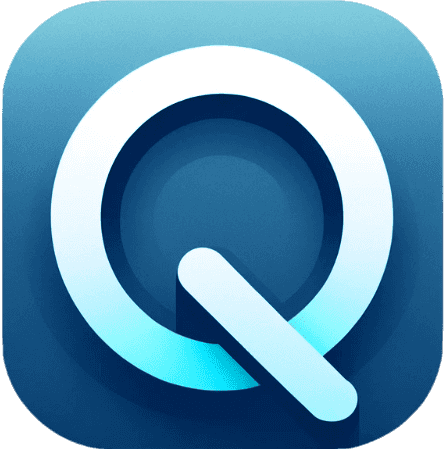
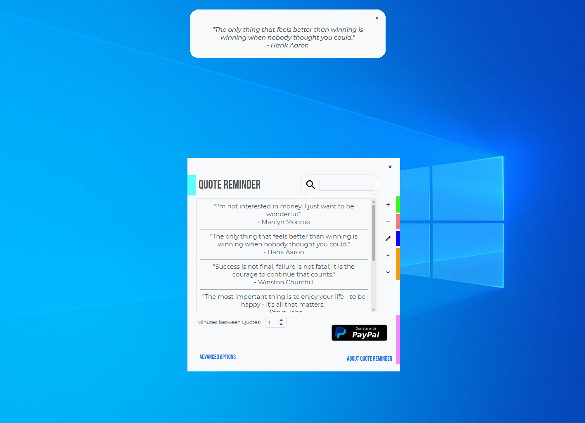

<!-- PROJECT LOGO -->
<br />
<div align="center">
  <a href="https://github.com/funghetto/Quote-Reminder">
    
  </a>

<h3 align="center">Quote Reminder</h3>

  <p align="center">
    GUI to periodically show reminders and quotes.
    <br />
    <a href="https://github.com/funghetto/Quote-Reminder/issues">Report Bug</a>
    ·
    <a href="https://github.com/funghetto/Quote-Reminder/issues">Request Feature</a>
  </p>
</div>


<!-- TABLE OF CONTENTS -->
<details>
  <summary>Table of Contents</summary>
  <ol>
    <li>
      <a href="#about-the-project">About The Project</a>       
      <ul>
        <li><a href="#built-with">Built With</a></li>
      </ul>
      <ul>
        <a href="#features">Features</a>
      </ul>
    </li>
    <li>
      <a href="#getting-started">Getting Started</a>
      <ul>
        <li><a href="#prerequisites for running from source">Prerequisites for running from source</a></li>
        <li><a href="#installation">Installation</a></li>
      </ul>
    </li>
    <li><a href="#license">License</a></li>
    <li><a href="#contact">Contact</a></li>
    <li><a href="#acknowledgments">Acknowledgments</a></li>
  </ol>
</details>


<!-- ABOUT THE PROJECT -->
## About The Project

<p align="center"></p>

Quote Reminder is a free and open source application, licensed under the GPLv3 licence to programmatically display user inserted quotes in the form of popups. It is based on Python, Qt 6, qdarktheme, pygame, PyQt-Frameless-Window and tendo.

<!-- FEATURES -->
## Features

* Possibility to change the quote position
* Gaming mode
* Quote sound
* Fading Quote animations
* Managing quote order and randomizing it
* Changing time between quotes
* Systray
* Autostart on system boot (only for the Windows binary)
* Dark Mode
* Search bar to find and edit quotes


### Built With

* [![Python][python3]][python3-url]
* [![Qt6][qt6]][qt6-url]


<!-- GETTING STARTED -->
## Getting Started

You can [download the Windows binary](https://github.com/funghetto/Quote-Reminder/releases/download/Main/QuoteReminder-WinBinary.zip) or clone the repo and start the program with Python.

### Prerequisites for running from source

Install Qt6 and Python 3

### Installation

1. Clone the repo
   ```sh
   git clone https://github.com/funghetto/Quote-Reminder.git
   ```
2. Install PIP packages
   ```sh
   pip install Pyside6 pyqtdarktheme tendo pygame
   ```
3. Change folder
   ```sh
   cd Quote-Reminder
   ```
4. Start the program
   ```sh
   python main.py
   ```


<!-- LICENSE -->
## License

Distributed under the GPL-3.0 License. See `LICENSE.txt` for more information.


<!-- CONTACT -->
## Contact

Project Link: [https://github.com/funghetto/Quote-Reminder](https://github.com/funghetto/Quote-Reminder)


<!-- ACKNOWLEDGMENTS -->
## Acknowledgments

* Thanks to JackEvo for the idea that inspired this project.


[issues-url]: https://github.com/funghetto/Quote-Reminder/issues
[license-url]: https://github.com/funghetto/Quote-Reminder/blob/master/LICENSE.txt
[product-screenshot]: images/screenshot.png
[python3]: https://img.shields.io/badge/python-3670A0?style=for-the-badge&logo=python&logoColor=ffdd54
[python3-url]: https://www.python.org/
[qt6]: https://img.shields.io/badge/Qt-6
[qt6-url]: https://www.qt.io/product/qt6
